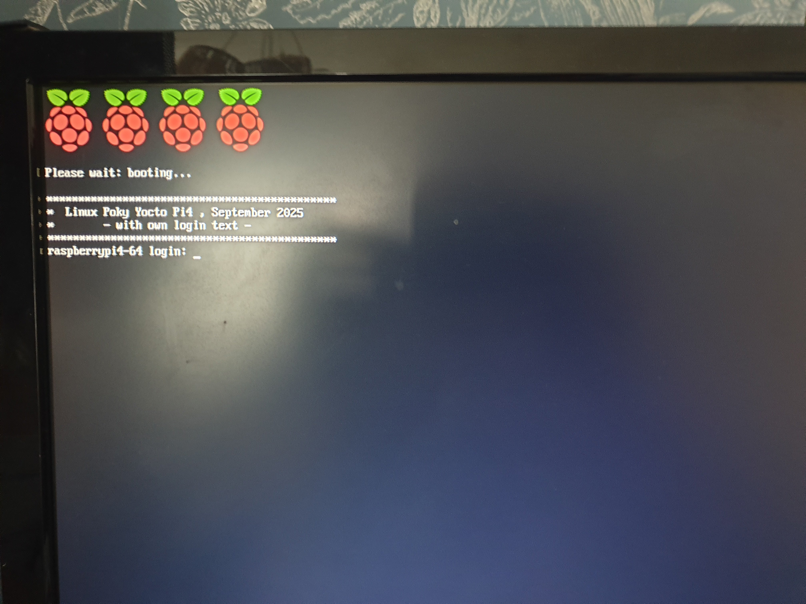

# Yocto_building_RaspberryPi4

## Purpose

Build a Yocto image for Raspberry Pi 4 with custom login texts via a separate layer. All modifications are contained in meta-yocto-building-raspberrypi4, keeping official layers untouched. 

1) Image has own login text added.

2) helloworld is fetched from GitHub repo and added to image ( see meta-yocto-building-raspberrypi4/recipes-example/helloworld/helloworld.bb)

3) Both Pi4 and qemu builds (sharing build cache)

### Prepare YOCTO directory

```bash
mkdir ~/YOCTO
cd ~/YOCTO
```


### Clone needed repos for layers

```bash
#Own custom layer
git clone https://github.com/mnokka/meta-yocto-building-raspberrypi4.git

#Core Yocto and Raspberry Pi layers (dunfell branch) 
git clone -b dunfell https://git.yoctoproject.org/poky.git
git clone git://git.yoctoproject.org/meta-raspberrypi -b dunfell
git clone git://git.openembedded.org/meta-openembedded -b dunfell
```


### Main directory tree
```
YOCTO
├── meta-openembedded
├── meta-raspberrypi
├── meta-yocto-building-raspberrypi4
├── poky
```


### Custom layer structure

```
meta-yocto-building-raspberrypi4
├── conf/
│   ├── layer.conf                # Layer basic configuration
│   └── machine/
│       └── raspberrypi4-64.conf  # Build and machine settings
└── recipes-core/
    └── base-files/
        ├── base-files_%.bbappend # bbappend replaces /etc/issue
        └── files/
            └── issue             # own login prompt text
└── recipes-example/
    └── helloworld/
        └── helloworld.bb       # Example program recipe
```


### Create/Set existing build directory:

source poky/oe-init-build-env BUILD-PI4

### Create layers:

```bash
bitbake-layers add-layer ../meta-openembedded/meta-oe
bitbake-layers add-layer ../meta-openembedded/meta-python
bitbake-layers add-layer ../meta-openembedded/meta-networking
bitbake-layers add-layer ../meta-openembedded/meta-multimedia
bitbake-layers add-layer ../meta-raspberrypi
bitbake-layers add-layer ../meta-yocto-building-raspberrypi4
```

Important: meta-yocto-building-raspberrypi4 contains all custom modifications, including login text (/etc/issue) and machine configuration.


### local conf changes

Some changes added to build directory conf/local.cof file (some can be layered later)
and are author machine (directory) spesific.

bblayers.conf

```bash

POKY_BBLAYERS_CONF_VERSION = "2"

BBPATH = "${TOPDIR}"
BBFILES ?= ""

BBLAYERS ?= " \
  /media/mika/YOCTO_T7/YOCTO/poky/meta \
  /media/mika/YOCTO_T7/YOCTO/poky/meta-poky \
  /media/mika/YOCTO_T7/YOCTO/poky/meta-yocto-bsp \
  /media/mika/YOCTO_T7/YOCTO/meta-openembedded/meta-oe \
  /media/mika/YOCTO_T7/YOCTO/meta-openembedded/meta-python \
  /media/mika/YOCTO_T7/YOCTO/meta-openembedded/meta-networking \
  /media/mika/YOCTO_T7/YOCTO/meta-openembedded/meta-multimedia \
  /media/mika/YOCTO_T7/YOCTO/meta-raspberrypi \
  /media/mika/YOCTO_T7/YOCTO/meta-yocto-building-raspberrypi4 \
  "
```

local.conf

#### local_conf/pi4 build:

```bash
MACHINE = "raspberrypi4-64"
...
ENABLE_UART = "1"

EXTRA_IMAGE_FEATURES += "debug-tweaks"
IMAGE_INSTALL:append = " packagegroup-core-ssh-openssh helloworld"
#PACKAGECONFIG:append:pn-qtbase = " eglfs"
BB_NUMBER_THREADS ?= "4"      
PARALLEL_MAKE ?= "-j 4"
# Yhteinen downloads-kansio
DL_DIR ?= "/media/mika/YOCTO_T7/YOCTO/downloads"
# Yhteinen sstate-cache
SSTATE_DIR ?= "/media/mika/YOCTO_T7/YOCTO/sstate-cache"
```

#### local_conf/QMEU build:

```bash
MACHINE ?= "qemuarm"
...
BB_NUMBER_THREADS ?= "4"
PARALLEL_MAKE ?= "-j 4"
# Yhteinen downloads-kansio
DL_DIR ?= "/media/mika/YOCTO_T7/YOCTO/downloads"
# Yhteinen sstate-cache
SSTATE_DIR ?= "/media/mika/YOCTO_T7/YOCTO/sstate-cache"
```

### Build the P4 image

```bash
cd BUILD-PI4
bitbake core-image-minimal 
```

Build images appear in BUILD-PI4/tmp/deploy/images/raspberrypi4-64

### Enable and rebuild the image

Edit conf/local.conf inside your build directory and add:


```bash
IMAGE_INSTALL:append = " helloworld"
```
```bash
bitbake core-image-minimal
```

Helloworld can be executed in Pi4 after flashing: helloworld


### Qemu build

 Only difference is the build directory setting and build/run commands

```bash
 source oe-init-build-env ../BUILD-QEMU
 bitbake core-image-minimal
 runqemu qemuarm core-image-minimal
```

### Flashing with BalenEtcher


https://www.balena.io/etcher/

Use image:

BUILD-PI4/tmp/deploy/images/raspberrypi4-64/core-image-minimal-raspberrypi4-64.wic.bz2


### RS232

Image has RS232 debug texts and possibility to login via RS232 activated. For debugging Linux can use minicom as a terminal

```bash
minicom -D /dev/ttyUSB0
```

A special USB-to-Raspberry Pi UART cable is required


### Example login screen




